# **You sure can attract a crowd**

----
## **Background**

The company has decided to crowdsale their PupperCoin token in order to help fund the network development.This network will be used to track dog breeding activity across the globe in a decentralized way, and allow humans to track the genetic trail of their pets. The company has already worked with the necessary legal bodies and obtained the green light on creating a crowdsale open to the public. 

---
## **Objective**
To create a CrowdSale contract that will available to public for a period of 24 weeks. The contract is  required to enable refunds if the crowdsale is successful and the goal is met, and you are only allowed to raise a maximum of 300 ether. The crowdsale will run for 24 weeks.

This crowdsale contract will manage the entire process, allowing users to send ETH and get back PPC (PupperCoin).
This contract will mint the tokens automatically and distribute them to buyers in one transaction.

---
## **Technologies/Tools/Libraries**
* Solidity
* OpenZeppelin Solidity library
* Metamask
---
## **Code Files**
* [PupperCoin](PupperCoin.sol)  
* [CrowdSale](Crowdsale.sol)

---
## **Outputs**
1. PupperCoin 
    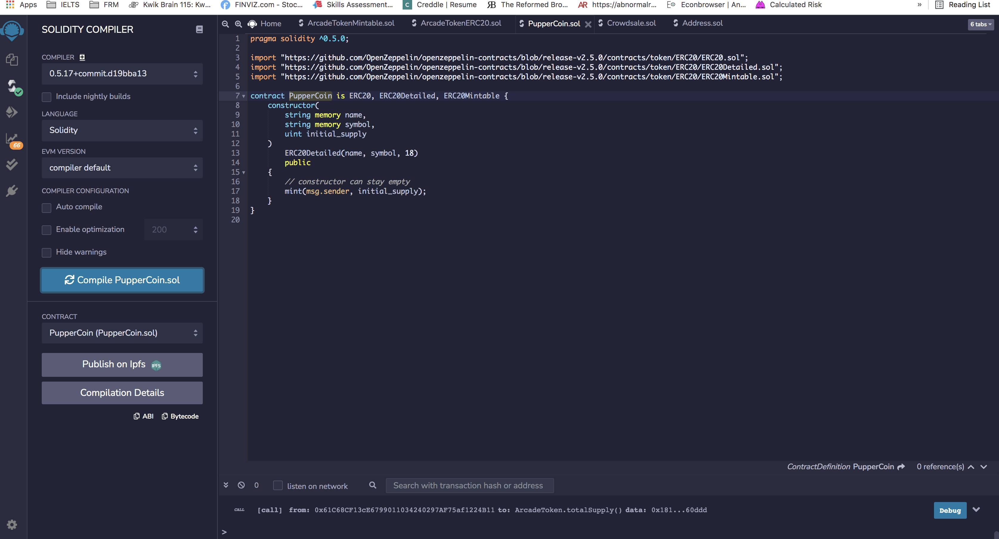
2. CrowdSale
    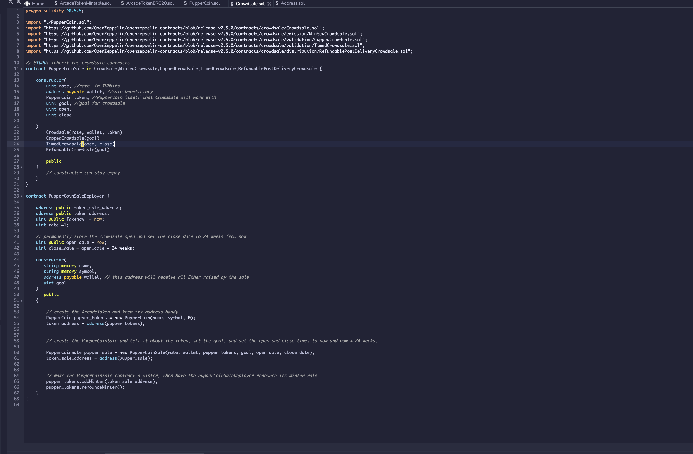
3. Testing the contract
    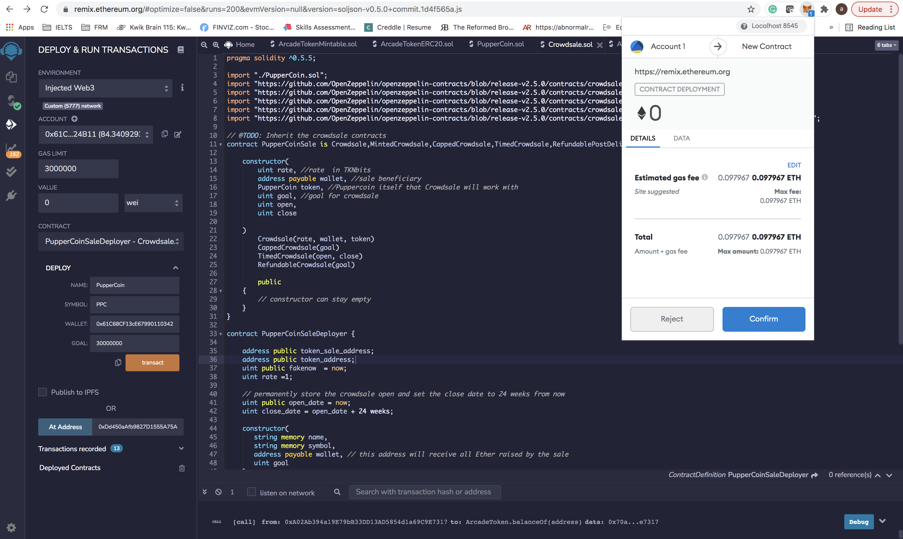  

    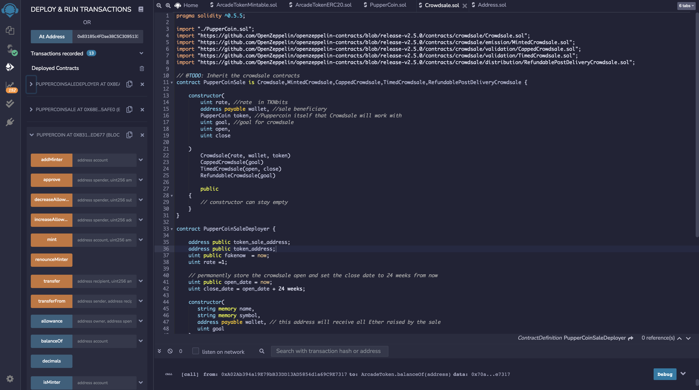  

    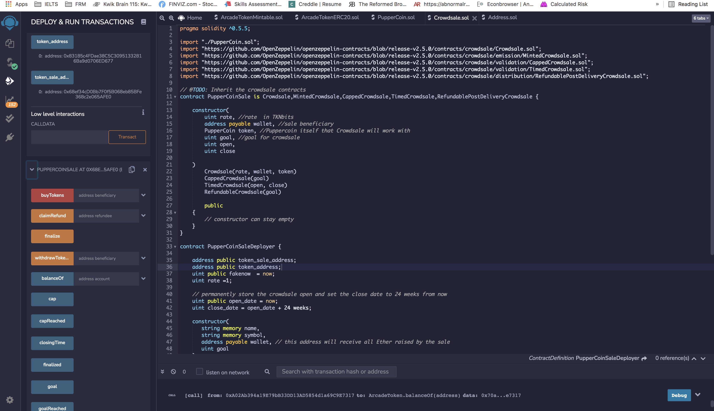    

    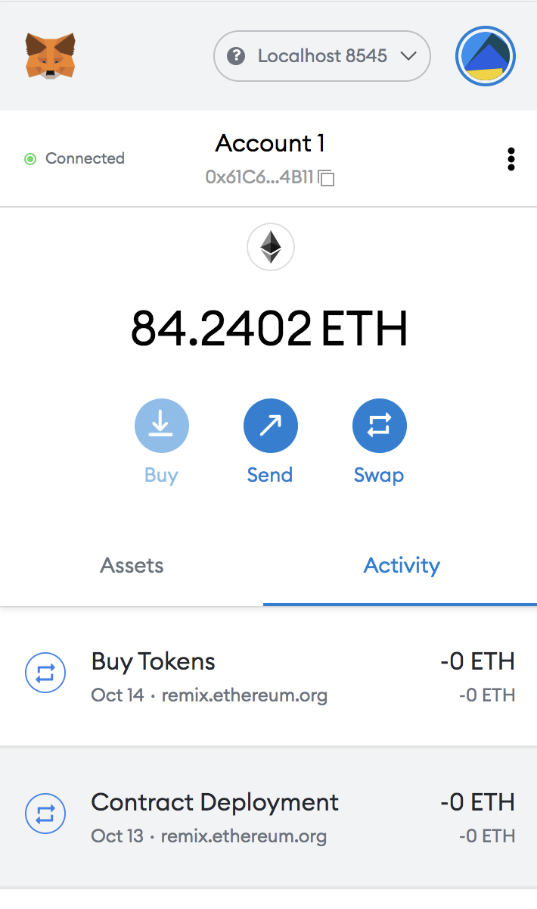  

    Buying Tokens for address  `0xA02Ab394a19E79bB33DD13AD5854d1a69C9E7317`

    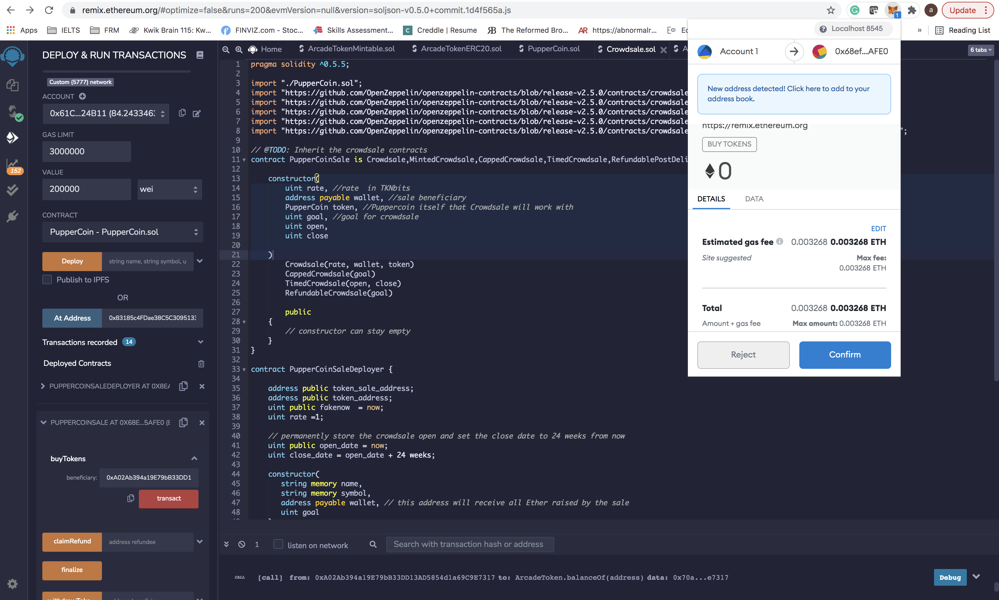  

    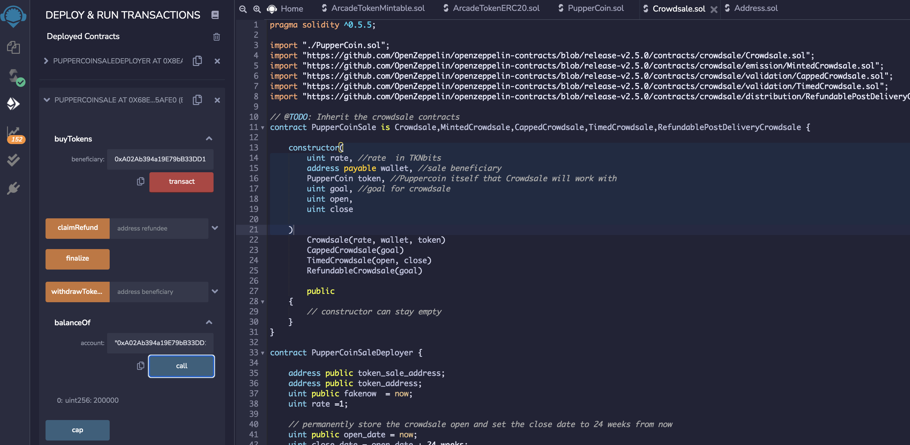  

    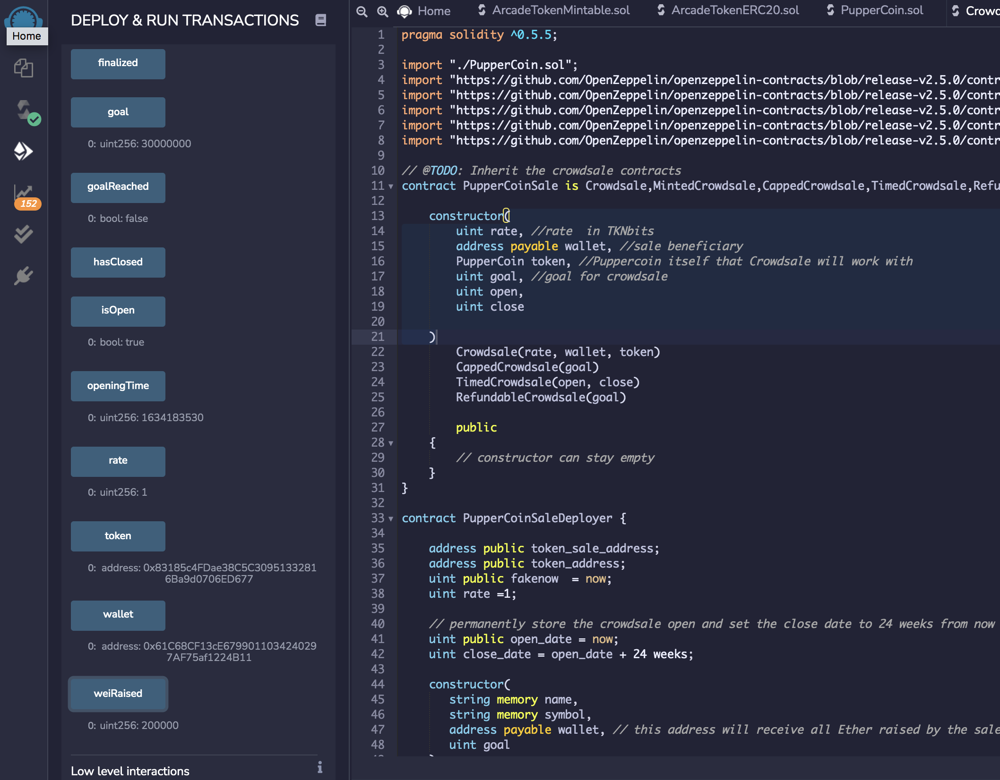  

    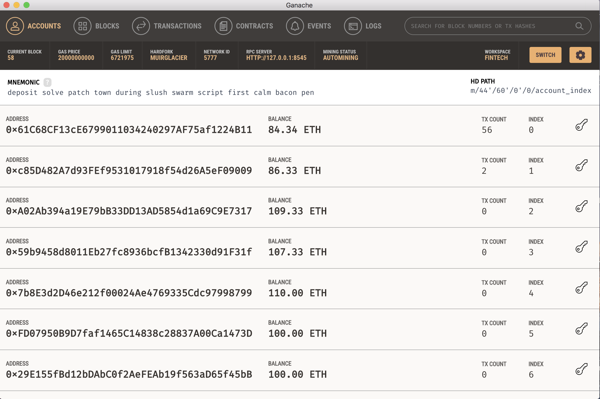  

    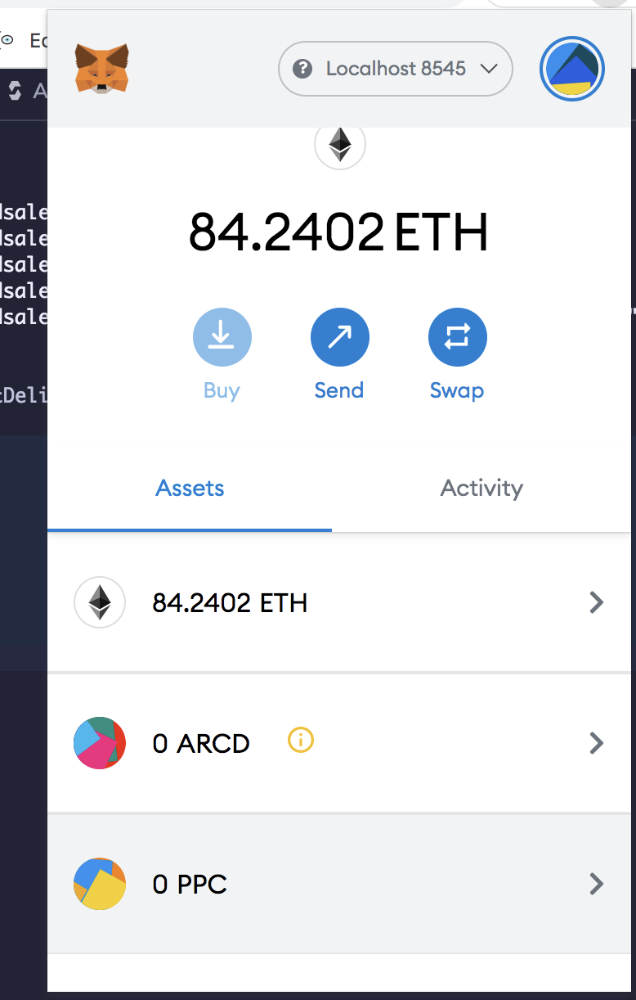  

    Sending token back to address `0x61C68CF13cE6799011034240297AF75af1224B11`   

    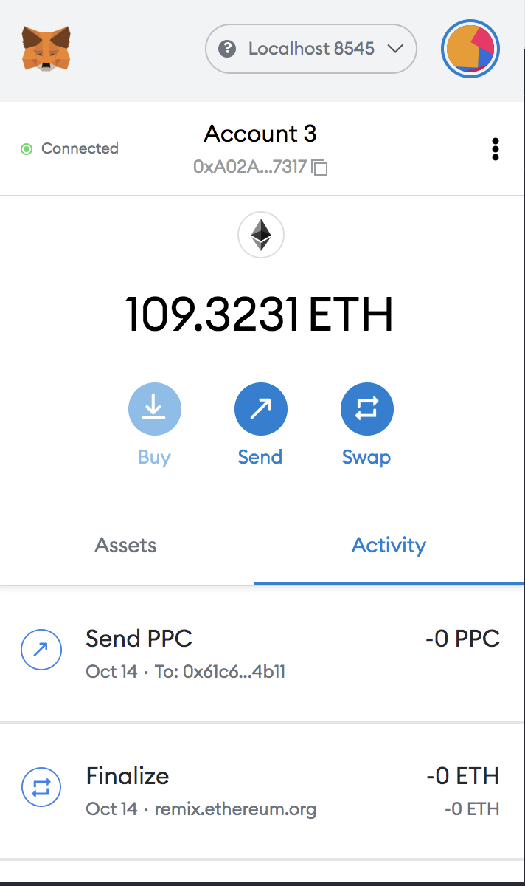

4. Contract Deployment on to Ropsten Network
    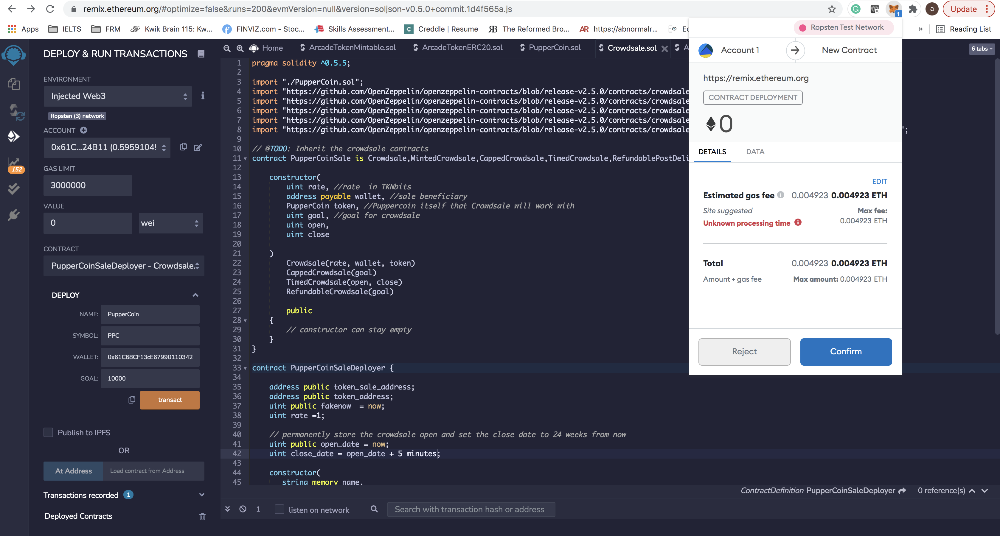 

    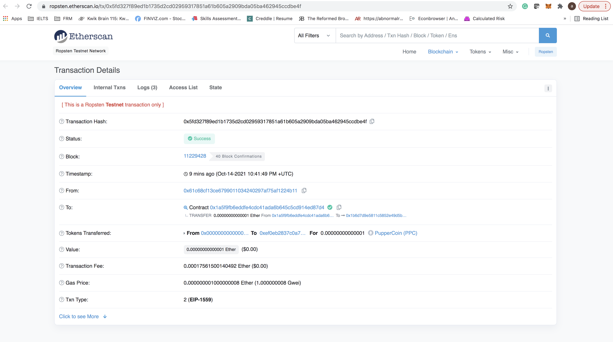 
   

   

