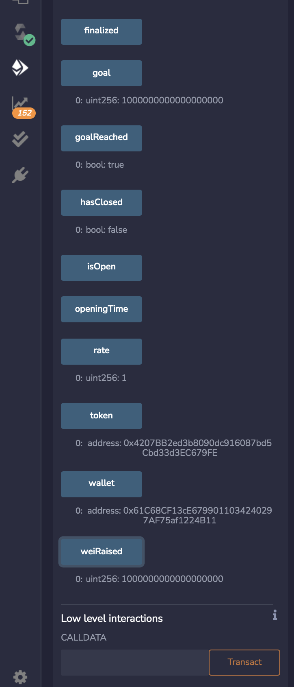
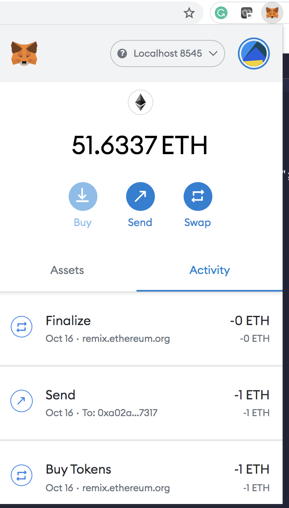

# **You sure can attract a crowd**

----
## **Background**

The company has decided to crowdsale their PupperCoin token in order to help fund the network development.This network will be used to track dog breeding activity across the globe in a decentralized way, and allow humans to track the genetic trail of their pets. The company has already worked with the necessary legal bodies and obtained the green light on creating a crowdsale open to the public. 

---
## **Objective**
To create a CrowdSale contract that will available to public for a period of 24 weeks. The contract is  required to enable refunds if the crowdsale is successful and the goal is met, and you are only allowed to raise a maximum of 300 ether. The crowdsale will run for 24 weeks.

This crowdsale contract will manage the entire process, allowing users to send ETH and get back PPC (PupperCoin).
This contract will mint the tokens automatically and distribute them to buyers in one transaction.

---
## **Technologies/Tools/Libraries**
* Solidity
* OpenZeppelin Solidity library
* Metamask
---
## **Code Files**
* [PupperCoin](PupperCoin.sol)  
* [CrowdSale](Crowdsale.sol)

---
## **Outputs**
1. PupperCoin.sol
    
2. CrowdSale.sol
    
3. Testing the contract  
    For testing the contract, the crowdsale duration was set to 3 minutes, in the contract that was deployed to Ropsten network the crowdsale close is set to 24 weeks.
    * Compiling the Crowdsale.sol
          
    * Contract deployment on local blockchain 
          

          

        `Name of Token` : `PupperCoin`  
        `Symbol` : `PPC`  
        `Wallet`: `0x61C68CF13cE6799011034240297AF75af1224B11`  
        `Goal`: `1000000000000000000`  (set to 10^18 wei ie 1 ETH)  

            

    * Buy Token of 1 ETH ie 10^18 wei for the wallet address `0x61C68CF13cE6799011034240297AF75af1224B11`  
          
          
          

    * Closing the Crowdsale 
          
          

    We can that the goal of crowdsale has been reached ie Goal reached= true ; wei raised = 10^18 wei.   
    
    By sending ether to another account on local blockchain,we ahead the block time. This is required to increase block time on local blockchain (Not required on the Ropsten Network,as blocks are continously added to the network)
          

    * Finalize the Crowdsale  
   
          

          

    * Withdraw the PPC tokens from the smart contract to the wallets  

          

          

    * Import PPC Token to the wallet

          

          

    * Send token to another wallet `Account3` : `0xA02Ab394a19E79bB33DD13AD5854d1a69C9E7317`

          

              
    

4. Contract Deployment on to Ropsten Network
     

     
   

   

